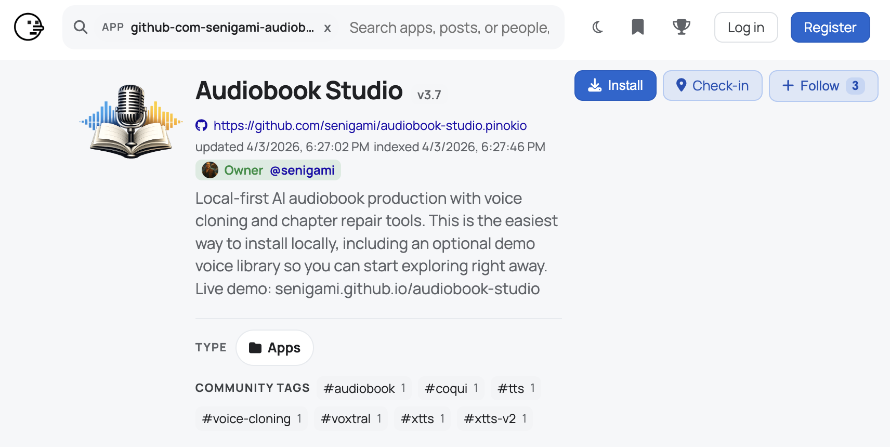
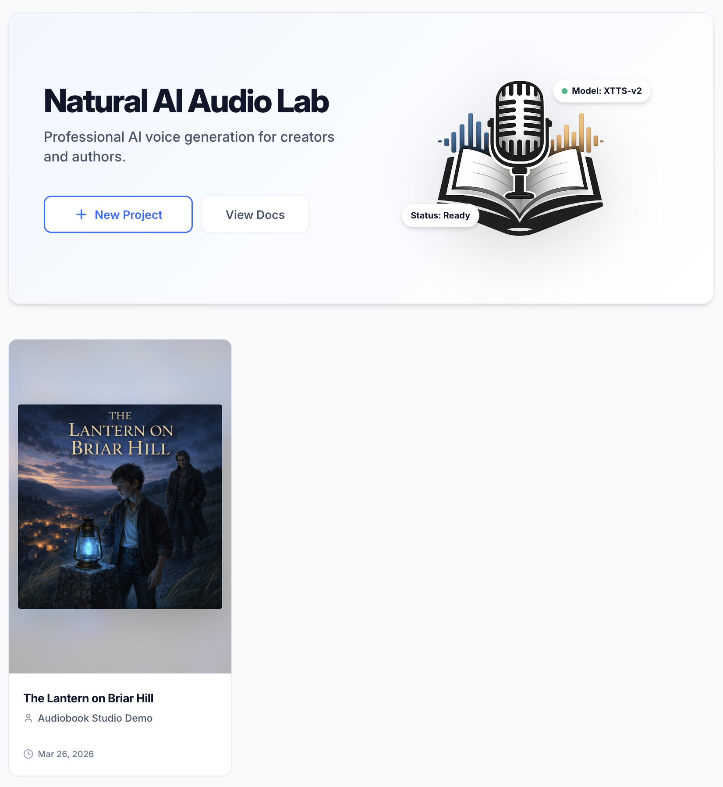

# Audiobook Studio for Pinokio

A Pinokio launcher for [Audiobook Studio](https://github.com/senigami/audiobook-studio), a local-first web studio for turning long-form text into finished audiobooks with cloned voices, chapter-based production, and final export tools.

Showcase:

https://senigami.github.io/audiobook-studio/

Main project:

https://github.com/senigami/audiobook-studio

## Start Here

This repository contains the **Pinokio launcher** for Audiobook Studio.

If you want the easiest way to install and run Audiobook Studio locally, use the Pinokio app page:

- **[Open Audiobook Studio on Pinokio](https://beta.pinokio.co/apps/github-com-senigami-audiobook-studio-pinokio)**
- **[View the Live Demo / Showcase](https://senigami.github.io/audiobook-studio/)**
- **[Read the Audiobook Studio Wiki](https://github.com/senigami/audiobook-studio/wiki)**
- **[View the Main Audiobook Studio Project](https://github.com/senigami/audiobook-studio)**

Pinokio is the best path for most non-technical users. It can also optionally install demo content on first run so you have something ready to explore.

## Why Audiobook Studio

Audiobook Studio is built for people who want more control over audiobook production:

- create audiobooks locally instead of relying on a hosted generation workflow
- clone and reuse narrator voices
- work chapter by chapter instead of in one giant monolithic run
- revise text, regenerate only what changed, and keep iterating
- export finished audiobook files from a self-hosted web interface

It is designed to make long-form narration workflows more practical, more private, and easier to own end to end.

## What This Pinokio Launcher Does

This repository is the Pinokio wrapper, not the full application source.

### Best For

Use this Pinokio version if you want:

- the easiest local install path
- less manual setup
- a guided launch experience
- optional demo content for first-time exploration

If you prefer direct repository control, scripts, or development setup, use the main project repo instead.

It will:

- clone the main Audiobook Studio repository
- run the project’s setup/install flow
- start the local web app
- expose the local URL through Pinokio
- update the install later with a pull + setup pass
- optionally install demo content on first run

## Main Features

Audiobook Studio includes:

- local voice cloning and reusable narrator profiles
- chapter-based generation workflows
- performance and rebuild tools for fixing only the pieces that need work
- multi-voice narration and dialogue assignment
- audiobook assembly and export
- local ownership of project files, voice assets, and generated output

## First Run and Demo Content

On a fresh install, Audiobook Studio can install demo content automatically so new users have something real to explore right away.

The demo library is highly recommended for your first launch. It allows you to:
- Test voice playback immediately
- Generate queued audio segments
- Rebuild partial chapter content
- Run the final M4B audiobook export

### 1. Opening the Demo Project
Immediately after installation, the Demo Project will appear in your Library. Open it to access the core production environment.

### 2. Exploring Pre-Configured Chapters
Navigate to the **Chapters tab** within the demo project. The chapters are ready for generation. From here, you can click to instantly listen to segments, place them in the queue, or press *Build Audiobook (M4B)* to assemble the completed work.

### 3. Reviewing Setup Voices
Under the **Voices tab**, you will see all the default pre-cloned narrative voices that were bundled with the demo. They are configured and ready to be used not only in this demo, but automatically in any other project you create.

## Platform Support

The launcher uses Audiobook Studio’s own startup scripts:

- macOS / Linux: `run.sh`
- Windows: `run.ps1`

Those scripts handle dependency setup and app startup for the main project.

## Notes

- This repository is the Pinokio launcher layer only.
- The main source code lives in the Audiobook Studio repo:
  - [https://github.com/senigami/audiobook-studio](https://github.com/senigami/audiobook-studio)
- If you want the full project details, docs, and release history, use the main repo and showcase link above.
